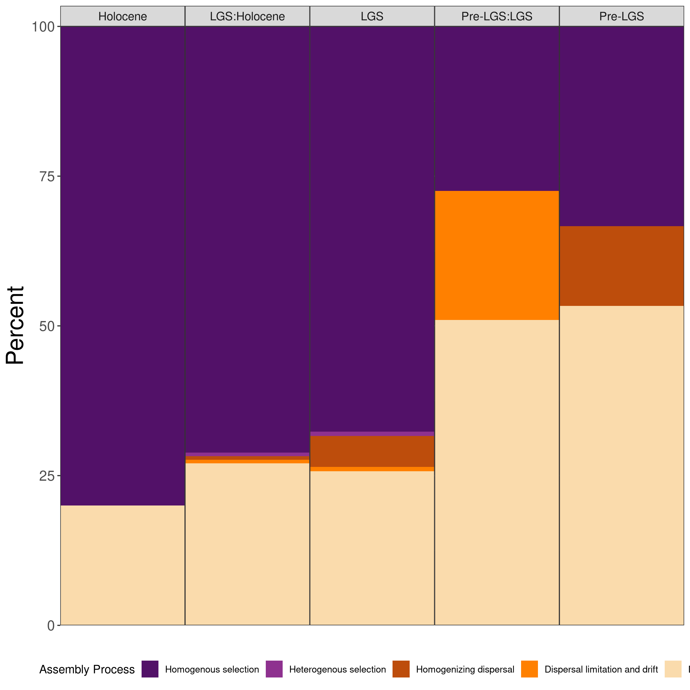
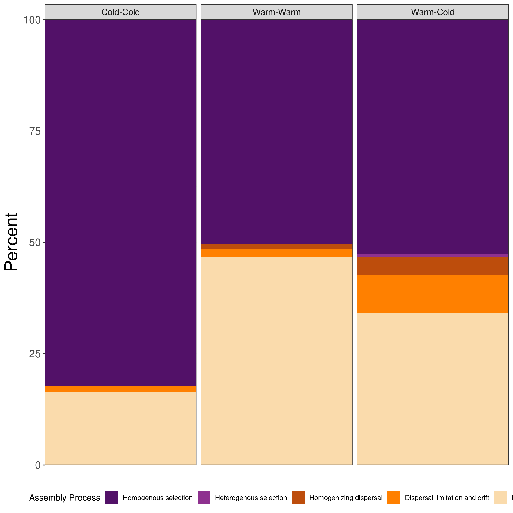
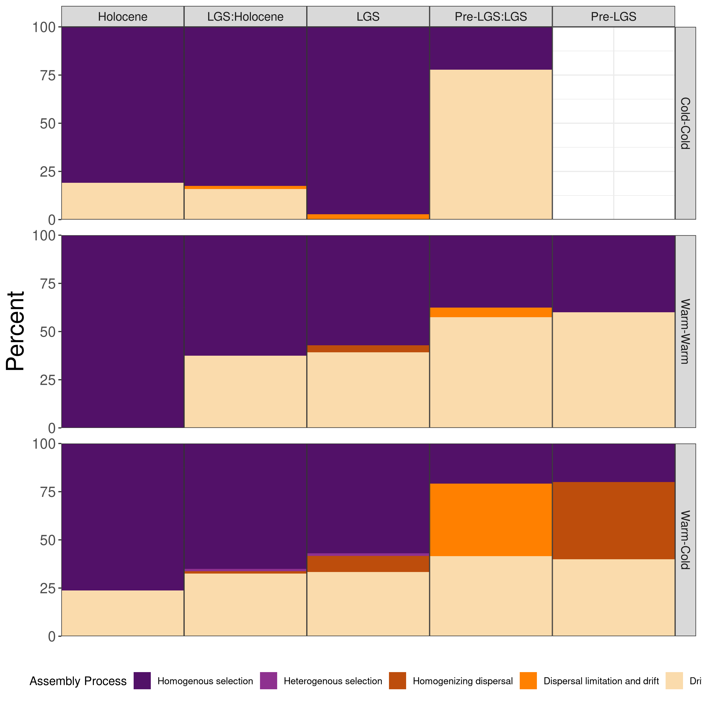
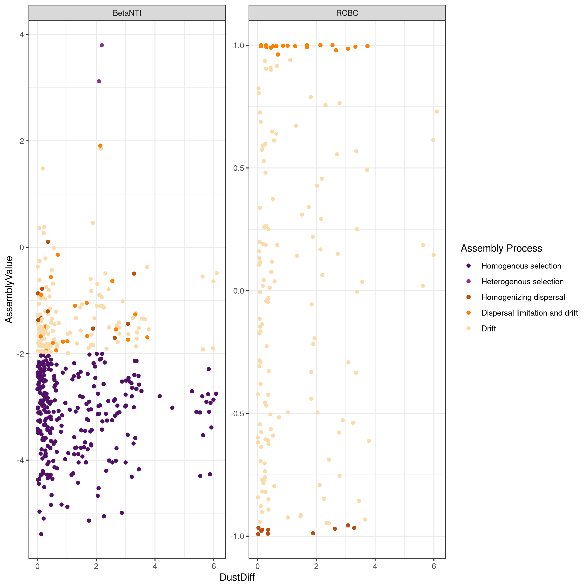
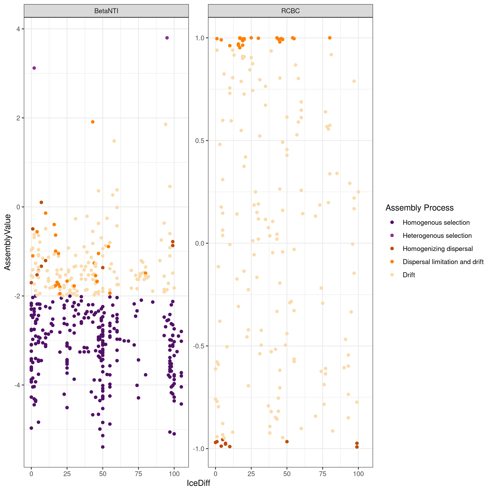
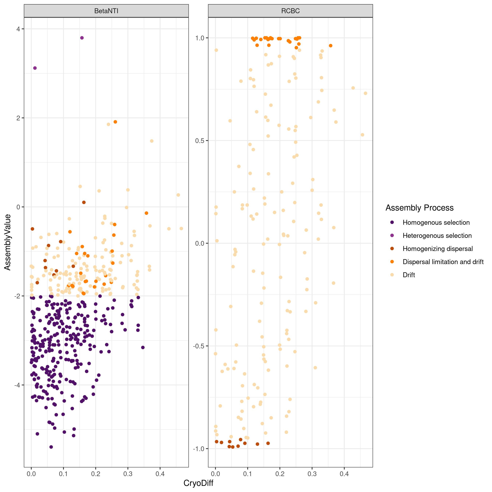

## Interpret Assembly Analysis results for Paleo Microbiome Project
***This step takes the output from 
03_prepare_and_combine_assembly_analysis_results.R and runs initial figures 
and analyses on them. It has been knit into a notebook for ease of interpretation***
# Driving questions:
 1. What assembly processes predominate in these paleo-microbiome samples?
 2. What assembly processes characterize each Epoch, and the Epoch transitions?
 3. What assembly processes drive cold to warm transitions?
 4. Do those processes differ in different Climate Epochs?
 Bonus: Are any other factors related to assembly processes?


``` r
# Loading necessary packages and data
library(tidyverse); packageVersion("tidyverse") # for dataframe processing
## [1] '2.0.0'
library(vegan); packageVersion("vegan") # for ecological applications
## [1] '2.6.10'
library(viridis)
library(cowplot) # Pretty plotting
library(here)

# Load required data
source(here("setup.R"))
## Samples missing from the OTU table that are present in the metadata: 
## Samples missing from the metadata that are present in the OTU table: 
## Now filtering out missing sample(s)...
## Removing columns with no data for any sample: 
## 33 samples in sample_metadata
## 33 samples in otu_table
## Removing 179 OTUs with zero abundnace for any sample (after filtering): OTU_284, OTU_356, OTU_482, OTU_558, OTU_585, OTU_629, OTU_742, OTU_881, OTU_1025, OTU_1098, OTU_1325, OTU_1382, OTU_1441, OTU_1487, OTU_1500, OTU_1530, OTU_1551, OTU_1580, OTU_1586, OTU_1626, OTU_1628, OTU_1633, OTU_1653, OTU_1669, OTU_1713, OTU_1732, OTU_1743, OTU_1758, OTU_1779, OTU_1902, OTU_1908, OTU_1921, OTU_1922, OTU_1956, OTU_1967, OTU_1969, OTU_1975, OTU_1976, OTU_1980, OTU_1983, OTU_1989, OTU_1992, OTU_2013, OTU_2016, OTU_2034, OTU_2035, OTU_2037, OTU_2039, OTU_2042, OTU_2044, OTU_2045, OTU_2082, OTU_2100, OTU_2104, OTU_2106, OTU_2109, OTU_2116, OTU_2117, OTU_2175, OTU_2186, OTU_2188, OTU_2223, OTU_2233, OTU_2234, OTU_2241, OTU_2242, OTU_2247, OTU_2251, OTU_2254, OTU_2255, OTU_2256, OTU_2257, OTU_2291, OTU_2317, OTU_2320, OTU_2329, OTU_2332, OTU_2370, OTU_2382, OTU_2383, OTU_2386, OTU_2390, OTU_2403, OTU_2406, OTU_2408, OTU_2415, OTU_2416, OTU_2418, OTU_2420, OTU_2421, OTU_2463, OTU_2467, OTU_2493, OTU_2498, OTU_2501, OTU_2502, OTU_2504, OTU_2544, OTU_2552, OTU_2553, OTU_2555, OTU_2557, OTU_2585, OTU_2586, OTU_2587, OTU_2588, OTU_2589, OTU_2592, OTU_2593, OTU_2595, OTU_2596, OTU_2597, OTU_2598, OTU_2601, OTU_2608, OTU_2664, OTU_2666, OTU_2667, OTU_2692, OTU_2700, OTU_2702, OTU_2703, OTU_2704, OTU_2706, OTU_2709, OTU_2710, OTU_2711, OTU_2766, OTU_2770, OTU_2774, OTU_2785, OTU_2790, OTU_2800, OTU_2801, OTU_2822, OTU_2823, OTU_2825, OTU_2827, OTU_2829, OTU_2835, OTU_2883, OTU_2894, OTU_2899, OTU_2900, OTU_2902, OTU_2903, OTU_2904, OTU_2905, OTU_2921, OTU_2927, OTU_2931, OTU_2934, OTU_2936, OTU_2937, OTU_2938, OTU_2939, OTU_2940, OTU_2941, OTU_2942, OTU_2943, OTU_2948, OTU_2952, OTU_2971, OTU_2979, OTU_2981, OTU_2990, OTU_2998, OTU_3001, OTU_3002, OTU_3003, OTU_3008, OTU_3011, OTU_3023, OTU_3025, OTU_3026, OTU_3027, OTU_3029, OTU_3043, OTU_3052
## [1] "Dropping taxa from the data because they are not present in the phylogeny:"
##  [1] "OTU_41"   "OTU_101"  "OTU_384"  "OTU_443"  "OTU_526"  "OTU_600"  "OTU_651"  "OTU_653" 
##  [9] "OTU_711"  "OTU_768"  "OTU_832"  "OTU_963"  "OTU_1039" "OTU_1089" "OTU_1107" "OTU_1127"
## [17] "OTU_1283" "OTU_1289" "OTU_1366" "OTU_1459" "OTU_1472" "OTU_1686" "OTU_1692" "OTU_1697"
## [25] "OTU_1815" "OTU_1875" "OTU_1889" "OTU_1944" "OTU_1995" "OTU_2014" "OTU_2015" "OTU_2020"
## [33] "OTU_2072" "OTU_2160" "OTU_2216" "OTU_2261" "OTU_2277" "OTU_2288" "OTU_2300" "OTU_2305"
## [41] "OTU_2343" "OTU_2360" "OTU_2362" "OTU_2367" "OTU_2373" "OTU_2391" "OTU_2393" "OTU_2411"
## [49] "OTU_2472" "OTU_2473" "OTU_2541" "OTU_2542" "OTU_2551" "OTU_2623" "OTU_2628" "OTU_2631"
## [57] "OTU_2642" "OTU_2657" "OTU_2677" "OTU_2678" "OTU_2707" "OTU_2732" "OTU_2735" "OTU_2746"
## [65] "OTU_2767" "OTU_2780" "OTU_2784" "OTU_2787" "OTU_2788" "OTU_2791" "OTU_2796" "OTU_2865"
## [73] "OTU_2890" "OTU_2893" "OTU_2945" "OTU_2978" "OTU_2982" "OTU_3007" "OTU_3020" "OTU_3038"
## [81] "OTU_3051" "OTU_3054"
## [1] "Dropping tips from the tree because they are not present in the data:"
##   [1] "OTU_1098" "OTU_1779" "OTU_2044" "OTU_2416" "OTU_2692" "OTU_2116" "OTU_2938" "OTU_2382"
##   [9] "OTU_2942" "OTU_2291" "OTU_1976" "OTU_2971" "OTU_2979" "OTU_2117" "OTU_3026" "OTU_1989"
##  [17] "OTU_2948" "OTU_2899" "OTU_356"  "OTU_1500" "OTU_1975" "OTU_2082" "OTU_2904" "OTU_2016"
##  [25] "OTU_1902" "OTU_2587" "OTU_2939" "OTU_742"  "OTU_2100" "OTU_1551" "OTU_2390" "OTU_3023"
##  [33] "OTU_1325" "OTU_2498" "OTU_2801" "OTU_2589" "OTU_2900" "OTU_2706" "OTU_2790" "OTU_1713"
##  [41] "OTU_2247" "OTU_3043" "OTU_2332" "OTU_2774" "OTU_2800" "OTU_2418" "OTU_3027" "OTU_2596"
##  [49] "OTU_1967" "OTU_2504" "OTU_2785" "OTU_2704" "OTU_2553" "OTU_2601" "OTU_2241" "OTU_2109"
##  [57] "OTU_2711" "OTU_2013" "OTU_2188" "OTU_2702" "OTU_2037" "OTU_2829" "OTU_2597" "OTU_2981"
##  [65] "OTU_2883" "OTU_2251" "OTU_2595" "OTU_1983" "OTU_1530" "OTU_2039" "OTU_2042" "OTU_2555"
##  [73] "OTU_2329" "OTU_3025" "OTU_3011" "OTU_1980" "OTU_2502" "OTU_2320" "OTU_2034" "OTU_2664"
##  [81] "OTU_2952" "OTU_2415" "OTU_2242" "OTU_2557" "OTU_1732" "OTU_1633" "OTU_2894" "OTU_2927"
##  [89] "OTU_2420" "OTU_585"  "OTU_3001" "OTU_3008" "OTU_2710" "OTU_2825" "OTU_2223" "OTU_2403"
##  [97] "OTU_2035" "OTU_2552" "OTU_2370" "OTU_1025" "OTU_1580" "OTU_1586" "OTU_1956" "OTU_1487"
## [105] "OTU_2406" "OTU_2943" "OTU_558"  "OTU_1922" "OTU_2902" "OTU_2608" "OTU_1653" "OTU_2905"
## [113] "OTU_881"  "OTU_2257" "OTU_2544" "OTU_2255" "OTU_2934" "OTU_1669" "OTU_2588" "OTU_2666"
## [121] "OTU_2421" "OTU_2937" "OTU_2317" "OTU_2822" "OTU_1758" "OTU_2941" "OTU_1921" "OTU_2598"
## [129] "OTU_2592" "OTU_2386" "OTU_2585" "OTU_2256" "OTU_2234" "OTU_2493" "OTU_2383" "OTU_2408"
## [137] "OTU_284"  "OTU_2045" "OTU_2186" "OTU_2936" "OTU_2104" "OTU_1992" "OTU_1969" "OTU_2233"
## [145] "OTU_3002" "OTU_2709" "OTU_2921" "OTU_2827" "OTU_2931" "OTU_2175" "OTU_2703" "OTU_482" 
## [153] "OTU_629"  "OTU_2903" "OTU_2940" "OTU_2463" "OTU_2998" "OTU_2593" "OTU_2990" "OTU_2667"
## [161] "OTU_2586" "OTU_2770" "OTU_2823" "OTU_2501" "OTU_1908" "OTU_2700" "OTU_1743" "OTU_2835"
## [169] "OTU_2254" "OTU_1626" "OTU_2106" "OTU_1628" "OTU_3003"
## OTU_IDs missing from the taxonomy that are present in the OTU table: 
## OTU_IDs missing from the tree that are present in the OTU table: 
## 2797 taxa in otu table
## 2797 tips in tree
## 2797 taxa in taxonomy
## [1] "Done with setup.R"

## Set up input and output directories
outputs.fp <- here("outputs")
figures.fp <- here("figures")

if (!dir.exists(outputs.fp)) {dir.create(outputs.fp)}
if (!dir.exists(figures.fp)) {dir.create(figures.fp)}

```


### Read in data not included in `setup.R`
Some important data processing notes: 
- Comparisons between Pre-LGS and Holocene samples have been filtered from the dataset. The logic behind this is that it doesn't make much sense to compare samples that are not consecutive in time.
- Epochs are ordered by time
- Temperature comparisons are ordered by "same-same", "different"
- After filtering out the Pre-LGS:Holocene comparisons, we are left with 468 comparisons


``` r
# Read in assembly analysis results
betanull.lf <- read_csv(file = paste0(outputs.fp, "/betanull.lf.csv"))

# Change variables into a factors
betanull.lf <- betanull.lf %>%
  mutate(across(starts_with("TempCondition"), ~ factor(.x, 
                                               levels = c("Cold-Cold", 
                                                          "Warm-Warm", 
                                                          "Warm-Cold")))) %>%
  mutate(EpochType = factor(EpochType, 
                            levels = c("Holocene", 
                                       "LGS:Holocene", 
                                       "LGS", 
                                       "Pre-LGS:LGS", 
                                       "Pre-LGS"))) %>%
  mutate(Assembly_Process = factor(Assembly_Process, 
                                   levels = c("Homogenous selection",
                                              "Heterogenous selection",
                                              "Homogenizing dispersal",
                                              "Dispersal limitation and drift",
                                              "Drift")))
```

 ### Question 1: What assembly processes predominate in these paleo-microbiome samples?


``` r
# Calculate proportions of pairwise comparisons overall
#### ====================================================================== ####
# Proportions across all samples
betanull.lf %>%
  select(Site1, Site2, BetaNTI, RCBC, Assembly_Process) %>%
  group_by(Assembly_Process) %>%
  tally() %>%
  mutate(Total = sum(n),
         Percent = round(100*n/Total, digits = 2)) %>%
  arrange(desc(Percent)) %>% knitr::kable()
```


|Assembly_Process               |   n| Total| Percent|
|:------------------------------|---:|-----:|-------:|
|Homogenous selection           | 282|   468|   60.26|
|Drift                          | 150|   468|   32.05|
|Dispersal limitation and drift |  24|   468|    5.13|
|Homogenizing dispersal         |  10|   468|    2.14|
|Heterogenous selection         |   2|   468|    0.43|


- Most of the pairwise comparisons are characterized by "Homogenous selection". This is typically considered to be the result of abiotic selection that favors some clades over others, rather than filtering sister taxa. 
- The second most common assembly process is ecological drift. This is a purely stochastic process. Assembly cannot be attributed to selection or dispersal. 
- We see essentially no evidence (only 2/468 comparisons) of heterogeneous (biotic) selection
  
  
### Question 2: What assembly processes characterize each Epoch, and the Epoch transitions?


``` r
# Summary plot by type
epochtype.plot.prop.df <- betanull.lf %>%
  select(Site1, Site2, Assembly_Process, EpochType) %>%
  group_by(EpochType, Assembly_Process) %>%
  tally() %>% 
  ungroup() %>% group_by(EpochType) %>%
  mutate(Total = sum(n),
         Percent = 100*n/Total)
  
epochtype.plot.prop <- epochtype.plot.prop.df %>%
  ggplot(aes(x= EpochType, y = Percent, 
             fill = Assembly_Process)) +
  facet_wrap(~EpochType, shrink = TRUE, drop = TRUE, nrow = 1,
             scales = "free_x") +
  geom_bar(stat = "identity") +
  scale_fill_manual(name = "Assembly Process", values = fill_assembly, 
                     breaks = assembly_levels, 
                     labels = assembly_labels) +
  xlab("") +
  scale_y_continuous(expand = c(0,0)) +
  scale_x_discrete(expand = c(0,0)) +
  #coord_cartesian(expand = c(0,0)) +
  theme_bw() + 
  theme(axis.text.x = element_blank(),
        axis.title.y = element_text(size = rel(2)),
        axis.text.y = element_text(size = rel(1.5)),
        panel.spacing.x = unit(0, "lines"),
        axis.ticks.x = element_blank(),
        strip.text = element_text(size = rel(1)),
        strip.placement = "outside",
        legend.position = "bottom")

epochtype.plot.prop.legend <- get_legend(epochtype.plot.prop)
#type.plot.prop <- type.plot.prop + theme(legend.position = "none")

ggsave(epochtype.plot.prop, 
       filename = paste0(figures.fp, "/epochType_prop.png"),
       width = 10, height = 10, dpi = 400)
epochtype.plot.prop
```

<div class="figure">

<p class="caption">plot of chunk unnamed-chunk-6</p>
</div>

- As time proceeds, we see an increase in the proportion of pariwise comparisons characterized by drift in our dataset.
- This pattern is often observed with depth in soils, more generally. It could be due to relic DNA (which experiences no selection), or it could be indicative that in previous epochs there were less selective pressures on the organisms forming these communities. 
- Interestingly, we don't see major increases in selctive processes at the Epoch-Epoch tansistions. 
- But, dipsersal limitation seems to have played a fairly strong role in the Pre-LGS:LGS transition. 
- The modern era communities are not at all characterized by dispersal, but there appears to be more of it in the LGS, and Pre-LGS periods. 
- This may suggest greater wind or water-mediated dispersal during these epochs.


### Question 3: What assembly processes characterize temperature transitions


``` r
# Temperature type
temptype.plot.prop.df <- betanull.lf %>%
  select(Site1, Site2, Assembly_Process, TempConditionType) %>%
  group_by(TempConditionType, Assembly_Process) %>%
  tally() %>% 
  ungroup() %>% group_by(TempConditionType) %>%
  mutate(Total = sum(n),
         Percent = 100*n/Total)

temptype.plot.prop <- temptype.plot.prop.df %>%
  ggplot(aes(x= TempConditionType, y = Percent, 
             fill = Assembly_Process)) +
  facet_wrap(~TempConditionType, shrink = TRUE, drop = TRUE, scales = "free_x") +
  geom_bar(stat = "identity") +
  scale_fill_manual(name = "Assembly Process", values = fill_assembly, 
                    breaks = assembly_levels, 
                    labels = assembly_labels) +
  xlab("") +
  scale_y_continuous(expand = c(0,0)) +
  scale_x_discrete(expand = c(0,0)) +
  #coord_cartesian(expand = c(0,0)) +
  theme_bw() + 
  theme(axis.text.x = element_blank(),
        axis.title.y = element_text(size = rel(2)),
        axis.text.y = element_text(size = rel(1.5)),
        axis.ticks.x = element_blank(),
        strip.text = element_text(size = rel(1)),
        strip.placement = "outside",
        legend.position = "bottom")

temptype.plot.prop.legend <- get_legend(temptype.plot.prop)
#type.plot.prop <- type.plot.prop + theme(legend.position = "none")

ggsave(temptype.plot.prop, 
       filename = paste0(figures.fp, "/tempType_prop.png"),
       width = 10, height = 10, dpi = 400)
temptype.plot.prop
```

<div class="figure">

<p class="caption">plot of chunk unnamed-chunk-7</p>
</div>

I plotted the proportion of different types of assembly processes in Warm-Cold transitions as well as pairwise comparisons where both samples were considered either warm or cold
- I expected that temperature changes would have a stronger homogeneous selective effect than those between the same temperature, but that was not the case.
- In fact, Cold-Cold comparisons seemed to have the strongest selective pressure, while warm-warm and warm-cold had about the same amount of homogeneous (abiotic) selection. 
- This may mean that cold exerts a greater selective pressure than warm, or possibly that cold conditions lead to other selective processes that are not present when warm conditions are present.
- The cold-warm transition is one of the few places we see heterogeneous selection which could be consistent with the idea that once "woken up" competition forces play a larger role in some communities.
- The major difference between same-same comparisons and "different" comparisions is in the dispersal processes. These appear to play a greater role, but both high dispersal, and dispersal limitation are present. 

### Question 4: Do those temperature processes differ in different Climate Epochs?
Given that we know that drift increases with depth, it might be a good idea to understand how cold-warm transitions play out within a particular climate Epoch, in case this is skewing our results


``` r
# Temperature comparisons within epoch type
epochtemptype.plot.prop.df <- betanull.lf %>%
  select(Site1, Site2, Assembly_Process, EpochType, TempConditionType) %>%
  group_by(EpochType, TempConditionType, Assembly_Process) %>%
  tally() %>% 
  ungroup() %>% group_by(EpochType, TempConditionType) %>%
  mutate(Total = sum(n),
         Percent = 100*n/Total)

epochtemptype.plot.prop <- epochtemptype.plot.prop.df %>%
  ggplot(aes(x= EpochType, y = Percent, 
             fill = Assembly_Process)) +
  facet_grid(TempConditionType~EpochType, drop = TRUE, scales = "free_x") +
  geom_bar(stat = "identity") +
  scale_fill_manual(name = "Assembly Process", values = fill_assembly, 
                    breaks = assembly_levels, 
                    labels = assembly_labels) +
  xlab("") +
  scale_y_continuous(expand = c(0,0)) +
  scale_x_discrete(expand = c(0,0)) +
  #coord_cartesian(expand = c(0,0)) +
  theme_bw() + 
  theme(axis.text.x = element_blank(),
        axis.title.y = element_text(size = rel(2)),
        axis.text.y = element_text(size = rel(1.5)),
        panel.spacing.y =  unit(1, "lines"),
        panel.spacing.x =  unit(0, "lines"),
        axis.ticks.x = element_blank(),
        strip.text = element_text(size = rel(1)),
        strip.placement = "outside",
        legend.position = "bottom")


epochtemptype.plot.prop.legend <- get_legend(epochtemptype.plot.prop)
#type.plot.prop <- type.plot.prop + theme(legend.position = "none")

ggsave(epochtemptype.plot.prop, 
       filename = paste0(figures.fp, "/epochtempType_prop.png"),
       width = 10, height = 11, dpi = 400)
epochtemptype.plot.prop
```

<div class="figure">

<p class="caption">plot of chunk unnamed-chunk-8</p>
</div>

- Here we see that there seems to be a greater increase in stochastic processes, as we saw before
- But one important difference is that the presence of dispersal processes does still seem to correspond to warm-cold transitions in the oldest climate epochs
- There are not clear trends within a given climate epoch of the differences in a cold-cold, cold-warm, or warm-warm trnaisition. Although Warm-warm and cold-warm transitions do seem to have more similarity than cold-cold. 
- With the exception of the Pre-LGS:LGS transition, cold-cold transitions are very strongly shaped by homogenizing selection, much more so than the warm-warm and cold-warm transitions in the same epoch.


### Bonus: Are any other factors related to assembly processes?
#### Dust differences and Assembly process


``` r
#### ====================================================================== ####
DustDiff.betanull <- betanull.lf %>%
  left_join(input_all$sample_metadata %>% select(SampleID, `Dust count per ml ice (diameter >0.63 μm)`), 
            by = c("Site1" = "SampleID")) %>%
  rename(Dust1 = `Dust count per ml ice (diameter >0.63 μm)`) %>%
  left_join(input_all$sample_metadata %>% select(SampleID, `Dust count per ml ice (diameter >0.63 μm)`), 
            by = c("Site2" = "SampleID")) %>%
  rename(Dust2 = `Dust count per ml ice (diameter >0.63 μm)`) %>%
  filter(Dust1 < 60, Dust2 < 60) %>% # filter out the really dusty sample
  mutate(DustDiff = abs(Dust1-Dust2)) %>%
  pivot_longer(cols = all_of(c("BetaNTI", "RCBC")), 
               names_to = "AssemblyMetric", values_to = "AssemblyValue")

corr.dustdiff.bnti <- DustDiff.betanull %>%
  filter(AssemblyMetric == "BetaNTI") %>%
  select(AssemblyValue, DustDiff) %>%
  cor.test(~ AssemblyValue + DustDiff, data = ., method = "pearson")

corr.dustdiff.RCBC <- DustDiff.betanull %>%
  filter(AssemblyMetric == "RCBC") %>%
  select(AssemblyValue, DustDiff) %>%
  cor.test(~ AssemblyValue + DustDiff, data = ., method = "pearson")


ggplot(DustDiff.betanull, 
       aes(x = DustDiff, y = AssemblyValue)) +
  geom_point(aes(color = Assembly_Process)) +
  scale_color_manual(name = "Assembly Process", values = fill_assembly, 
                    breaks = assembly_levels, 
                    labels = assembly_labels) +
  facet_wrap(~AssemblyMetric, scales = "free_y") +
  theme_bw()
```

<div class="figure">

<p class="caption">plot of chunk unnamed-chunk-9</p>
</div>

As dust amounds increase in difference between samples, dispersal processes 
do not appear to increase


#### Ice Volume differences and Assembly process


``` r
IceDiff.betanull <- betanull.lf %>%
  left_join(input_all$sample_metadata %>% select(SampleID, `Ice volume (ml)`), 
            by = c("Site1" = "SampleID")) %>%
  rename(Ice1 = `Ice volume (ml)`) %>%
  left_join(input_all$sample_metadata %>% select(SampleID, `Ice volume (ml)`), 
            by = c("Site2" = "SampleID")) %>%
  rename(Ice2 = `Ice volume (ml)`) %>%
  mutate(IceDiff = abs(Ice1-Ice2)) %>%
  pivot_longer(cols = all_of(c("BetaNTI", "RCBC")), 
               names_to = "AssemblyMetric", values_to = "AssemblyValue")

corr.icediff.bnti <- IceDiff.betanull %>%
  filter(AssemblyMetric == "BetaNTI") %>%
  select(AssemblyValue, IceDiff) %>%
  cor.test(~ AssemblyValue + IceDiff, data = ., method = "pearson")

corr.icediff.RCBC <- IceDiff.betanull %>%
  filter(AssemblyMetric == "RCBC") %>%
  select(AssemblyValue, IceDiff) %>%
  cor.test(~ AssemblyValue + IceDiff, data = ., method = "pearson")

ggplot(IceDiff.betanull, 
       aes(x = IceDiff, y = AssemblyValue)) +
  geom_point(aes(color = Assembly_Process)) +
  scale_color_manual(name = "Assembly Process", values = fill_assembly, 
                     breaks = assembly_levels, 
                     labels = assembly_labels) +
  facet_wrap(~AssemblyMetric, scales = "free_y") +
  theme_bw()
```

<div class="figure">

<p class="caption">plot of chunk unnamed-chunk-10</p>
</div>

#### Cryobacterium differences and Assembly process
As ice amounds increase in difference between samples, dispersal processes 
do not appear to increase


``` r
# Cryobacterium names
cryobacterium <- input_all$taxonomy %>% filter(Genus == "D_5__Cryobacterium")
Cryo_abund <- input_all$otu_table %>%
  mutate(Cryobacterium = ifelse(OTU_ID %in% cryobacterium$OTU_ID, "Cryobacterium", "Other")) %>%
  pivot_longer(starts_with("D"), names_to = "SampleID", values_to = "Counts") %>%
  group_by(SampleID) %>%
  mutate(TotalCount = sum(Counts)) %>% ungroup() %>%
  group_by(SampleID, Cryobacterium) %>%
  mutate(CryoCount = sum(Counts)) %>%
  ungroup() %>% group_by(SampleID) %>%
  mutate(RelAbundCryo =  CryoCount/TotalCount) %>%
  select(SampleID, Cryobacterium, RelAbundCryo, TotalCount, CryoCount) %>%
  filter(Cryobacterium!="Other") %>%
  distinct()
```

Does the relative abundance of Cryobacterium appear to influence assemlby processes?


``` r
CryoDiff.betanull <- betanull.lf %>%
  left_join(Cryo_abund %>% select(SampleID, RelAbundCryo), 
            by = c("Site1" = "SampleID")) %>%
  rename(Cryo1 = RelAbundCryo) %>%
  left_join(Cryo_abund %>% select(SampleID, RelAbundCryo), 
            by = c("Site2" = "SampleID")) %>%
  rename(Cryo2 = RelAbundCryo) %>%
  mutate(CryoDiff = abs(Cryo1-Cryo2)) %>%
  pivot_longer(cols = all_of(c("BetaNTI", "RCBC")), 
               names_to = "AssemblyMetric", values_to = "AssemblyValue")

corr.cryodiff.bnti <- CryoDiff.betanull %>%
  filter(AssemblyMetric == "BetaNTI") %>%
  select(AssemblyValue, CryoDiff) %>%
  cor.test(~ AssemblyValue + CryoDiff, data = ., method = "pearson")

corr.cryodiff.RCBC <- CryoDiff.betanull %>%
  filter(AssemblyMetric == "RCBC") %>%
  select(AssemblyValue, CryoDiff) %>%
  cor.test(~ AssemblyValue + CryoDiff, data = ., method = "pearson")


ggplot(CryoDiff.betanull, 
       aes(x = CryoDiff, y = AssemblyValue)) +
  geom_point(aes(color = Assembly_Process)) +
  scale_color_manual(name = "Assembly Process", values = fill_assembly, 
                     breaks = assembly_levels, 
                     labels = assembly_labels) +
  facet_wrap(~AssemblyMetric, scales = "free_y") +
  theme_bw()
```

<div class="figure">

<p class="caption">plot of chunk unnamed-chunk-12</p>
</div>

- The relative abundance of Cryobacterium does appear to influence assembly processes (pearson correlation ~ 0.4 in each case, significant at the 0.05 level). 
- Samples with more similar Cryobacterium communities have stronger homogenizing selective processes than those with very different cyobacterium relative abundances. Similarly, for stochastic processes, very different cryobacterium relative abundances seem related to dispersal limitation, while similar abundances have more homogenizing selection. 


## Concluding Thoughts
- We see strong evidence of abiotic selective processes driving the structure of these communities. Ecological drift is a second dominant assembly process. There is little evidence of biotic structuring within the community.
- This doesn't mean that there is no biotic structuring, just that it doesn't show up as a sister-taxa competition. Other forms of biotic structuring, such as food-web type structuring cannot be ruled out via this method. What this does imply is that the conditions at hand, strongly favor particular sets of clades. 
- Ecological drift increases with time. This is hard to attribute. We cannot rule out the influence of relic DNA, or active entrained cells in this pattern.  However one piece of evidence against active entrained cells is a lack of "dispersal limitation with drift", which I would expect to see more of if cells were actively growing in these ice cores. What is clear is that there are stronger abiotic selective pressures nearer the top of the core.
- Climate epoch has a stronger influence on assembly process than temperature variation within an epoch. This may be due to different environmental/ecological forces being at play during each epoch. For example, climatic shifts, deposition shifts, or different sources of microbial communities. 
- Microbial communities are significantly different in warm vs. cold periods. Interestingly cold seems to impart a greater selective pressure than warmth. This may align with the role of photorophs in structuring the community, since colder years likely include less available light for phototrophs which could have downstream selective pressures on the community. 
